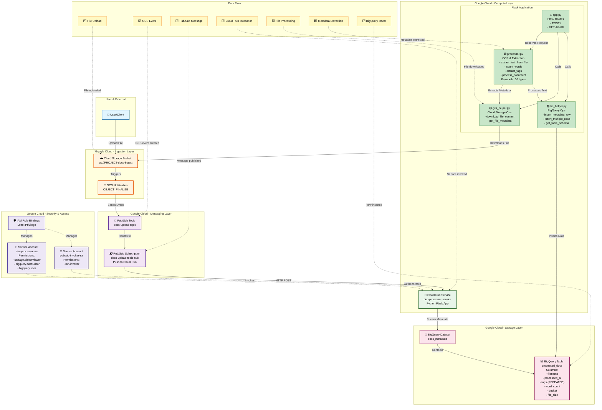
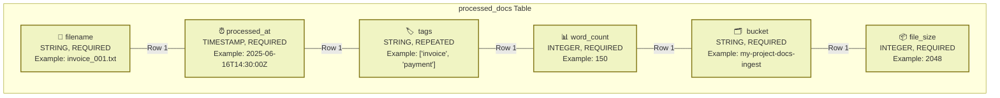
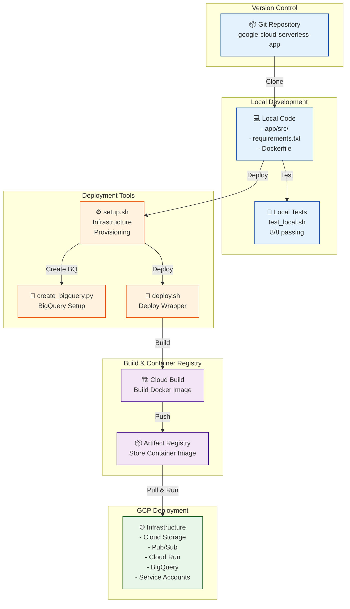
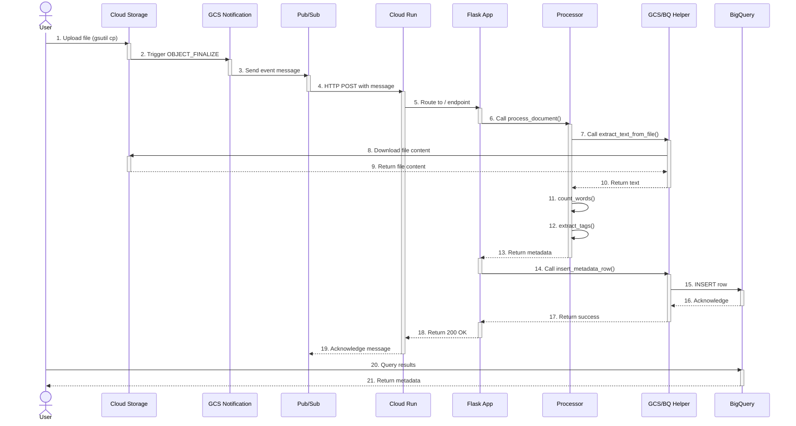
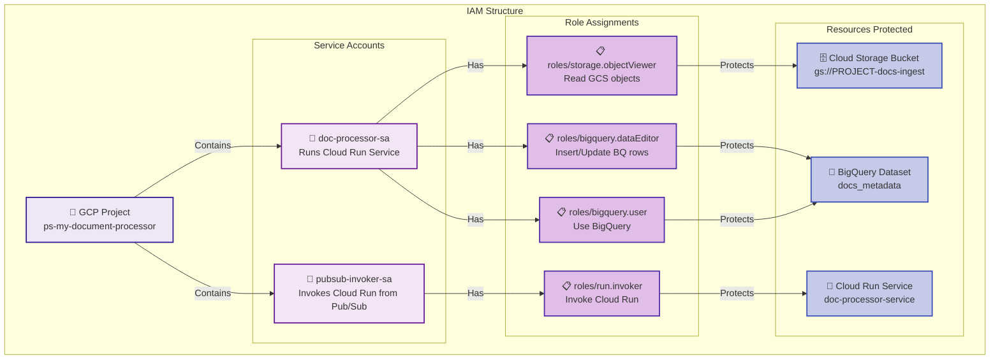
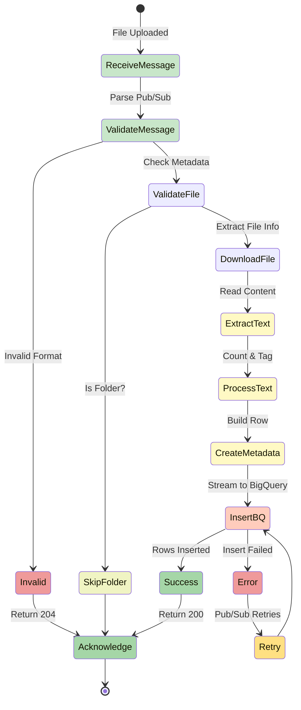
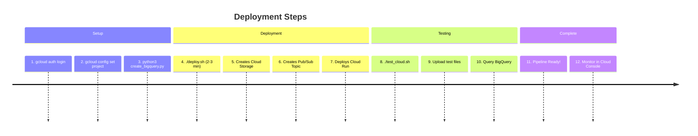

# Architecture Diagram - Event-Driven Document Processing Pipeline

## System Architecture

## Component Interaction Diagram

```mermaid
graph LR
    subgraph "Input"
        FILE["📄 Document File<br/>(txt, pdf, image)"]
    end

    subgraph "Processing Pipeline"
        STEP1["1. Parse Event<br/>Extract bucket & file"]
        STEP2["2. Download File<br/>from Cloud Storage"]
        STEP3["3. Extract Text<br/>Real or simulated OCR"]
        STEP4["4. Count Words<br/>Process text"]
        STEP5["5. Extract Tags<br/>Keyword matching"]
        STEP6["6. Create Metadata<br/>Row object"]
        STEP7["7. Insert to BigQuery<br/>Stream data"]
    end

    subgraph "Output"
        METADATA["📊 Stored Metadata<br/>Queryable in BigQuery"]
    end

    FILE -->|Pub/Sub Event| STEP1
    STEP1 -->|GCS path| STEP2
    STEP2 -->|File content| STEP3
    STEP3 -->|Text| STEP4
    STEP4 -->|Word count| STEP5
    STEP5 -->|Tags| STEP6
    STEP6 -->|Row data| STEP7
    STEP7 -->|INSERT| METADATA

    classDef input fill:#b3e5fc,stroke:#01579b
    classDef process fill:#c8e6c9,stroke:#2e7d32
    classDef output fill:#fce4ec,stroke:#880e4f

    class FILE input
    class STEP1,STEP2,STEP3,STEP4,STEP5,STEP6,STEP7 process
    class METADATA output
```

## Data Model - BigQuery Table Schema

## Deployment Architecture

## Request Flow - Detailed Sequence

## Security & IAM Architecture

## Processing States & Error Handling

---

## Key Metrics

| Component | Technology | Scalability | Cost |
|-----------|------------|------------|------|
| Ingestion | Cloud Storage | Unlimited | $0.02-0.04/GB |
| Messaging | Pub/Sub | 1M+ msg/sec | $0.40/1k msgs |
| Compute | Cloud Run | Auto-scaling 0-100+ | $0.00002400/vCPU-sec |
| Storage | BigQuery | PB-scale | $0.01/row or $6.25/TB |

## Deployment Timeline

